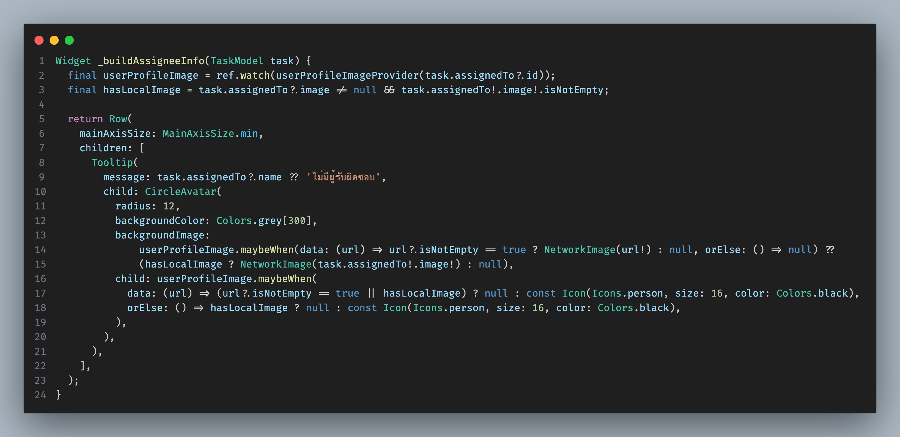

![Image of Yaktocat]
# 📅 Day 49 - วันที่ 49 ของการฝึกงาน
**วันที่:** 22 สิงหาคม 2025  
**สถานที่ฝึกงาน:** บริษัท TECH CARE SOLUTION Co.Ltd,  
**ตำแหน่ง:** นักพัฒนาซอฟต์แวร์ฝึกหัด


---

## 📝 สิ่งที่ได้ทำในวันนี้
**อัพเดตงานที่ได้รับมอบหมาย:**
- โจทย์ของงานคือ 
   ถ้า User มีรูปโปรไฟล์ให้แสดงรูป 
   ถ้า User ไม่มีรูปโปรไฟล์ให้แสดง Icon.person


## 🎯 สิ่งที่เรียนรู้ในวันนี้ 
  ### backgroundImage 
ถ้า userProfileImage อยู่สถานะ data และ url ไม่ว่าง → ใช้ NetworkImage(url)
ไม่ใช่ข้อ 1 → ถ้า hasLocalImage เป็นจริง → ใช้ NetworkImage(task.assignedTo!.image!)
ไม่เข้าเงื่อนไขใดเลย → backgroundImage = null
#### child
ถ้ามีรูปจาก provider หรือ มีรูปในโมเดล → child = null (ไม่ต้องมีไอคอน)
ถ้าไม่มีรูปเลย → แสดงไอคอน Icons.person 



### การใช้CachedNetworkImage
imageUrl: ใช้รูปจาก task.assignedTo?.image ถ้าไม่มี → ให้เป็น '' (สตริงว่าง)
errorWidget: ถ้าโหลดรูปไม่ได้ เช่น URL ว่าง/ผิด/โหลดไม่สำเร็จ → แสดง Icon(Icons.person) ขนาด 16px สีดำ
#### ข้อดีของวิธีนี้
ใช้แคชอัตโนมัติ → โหลดรูปครั้งเดียว เก็บไว้ในเครื่อง เวลาเปิดใหม่ไม่ต้องโหลดซ้ำ
มี fallback (errorWidget) → ถ้ารูปหายก็ยังแสดงไอคอนคนแทน
อ่านโค้ดง่ายขึ้นกว่าการเช็ค maybeWhen หลายชั้น


## ความแตกต่างของทั้งสองโค้ด
- ใช้ CachedNetworkImage ตรง ๆ
เขียนสั้นและง่าย: ใช้ CachedNetworkImage ตรง ๆ โหลดและแคชรูปเลย
มี error handling ในตัว: ถ้ารูปโหลดไม่ได้ จะแสดง Icon
แคชอัตโนมัติ: ลดการโหลดรูปซ้ำจาก network
- ใช้ backgroundImage 
ซับซ้อนกว่า → โค้ดยาวและอ่านยากขึ้น
ต้องมี provider (userProfileImageProvider) → ต้องเซ็ตเพิ่มในระบบ ไม่ใช่ plug-and-play แบบ CachedNetworkImage


---


---

## 🤔 ปัญหาที่พบวันนี้
- ไม่เข้าใจโค้ดที่ตัวเองเขียน ทำให้ไม่สามารถอธิบายโค้ดได้
- 


```

```


---

## ✅ วิธีแก้ไข
- ปรึกษาพี่เลี้ยงและทำความเข้าใจตามที่พี่เลี้ยงแนะนำ


---

## 💡 สิ่งที่อยากพัฒนาต่อ
- ฝึกเขียนโปรแกรมให้มากขึ้น
- ทบทวนสิ่งที่ได้ทำบ่อย ๆ


---

## 😄 ความรู้สึกวันนี้
- 